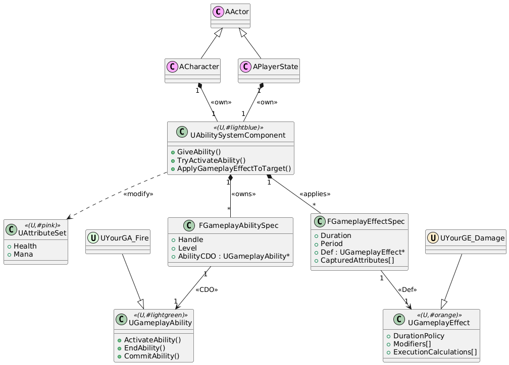

# FGameplayEffectModCallbackData
FGameplayEffectModCallbackData
- EffectSpec
  - FGameplayEffectContextHandle
  - UAbilitySystemComponent(Source)
    - AbilityActorInfo(弱指针结构体)
      - AvatarActor
      - AController
        - APawn
        - ACharacter
- EvaluatedData
- Target

先拿 Data，再拿 Context，再拿 ASC，再拿 Info，最后取 Avatar/Controller。”