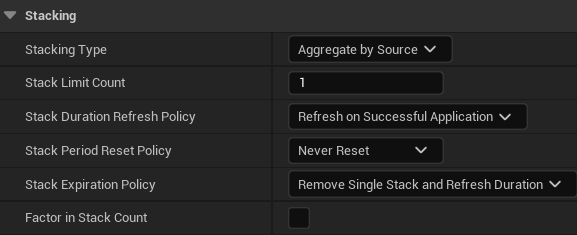

# GameEffect类的Stack选项

> 当 **同一个GameEffect效果被多次施加** 时，如何 **叠层、刷新时间、到期结算**。

---

### 1. Stacking Type（堆叠方式）
| 选项 | 含义                                      |
|------|-----------------------------------------|
| **None** | 独立同时作用，互不影响                             |
| **Aggregate by Target** | 叠层，所有层数 **归同一个作用目标** 管理（最常用），同一目标限制叠加上限 |
| **Aggregate by Source** | 叠层，每类来源（Source）独立计算层数。如同一**类**血瓶来源限制叠加上限    |
> 注：不管哪种叠层，都仅在GE内部生效，不存在跨GE叠同一栈的情况。
---

### 2. Stack Limit Count
最大层数，**达到后继续施加会触发 Overflow 逻辑，根据后续选项产生对应效果**。  
0 表示 **无上限**。

---

### 3. Stack Duration Refresh Policy
| 选项 | 效果 |
|------|------|
| **Refresh on Successful Application** | 每加一层 **重置整栈持续时间**（DOT 类毒药常用）。 |
| **Never Refresh** | 每层保持自己的剩余时间，**不刷新**。 |
> 注：栈中的每一层持续时间是独立同时计时的，互不影响。刷新后，所有层的持续时间都会被重置为新的持续时间。
---

### 4. Stack Period Reset Policy
针对 **周期性（Periodic）GE** 的 **“计时器”** 是否重置。

| 选项 | 效果 |
|------|------|
| **Reset on Successful Application** | 加层时把 **周期计时器清零**（立即触发一次 Tick）。 |
| **Never Reset** | 周期节奏不变，**不会提前 Tick**。 |

---

### 5. Stack Expiration Policy
 **当任意一层到期时** 如何处理整栈。

| 选项 | 效果                        |
|------|---------------------------|
| **Clear Entire Stack** | **整栈直接移除**（层数归 0）。        |
| **Remove Single Stack and Refresh Duration** | 移除一层，重置剩余层时间              |
| **Refresh Duration** | 到期时 **刷新该层持续时间**（实现“无限续杯”）。 |

---

### 6. Factor in Stack Count
 勾选后，**Modifiers 里的 Magnitude 会自动 × 当前层数**。  
> 例：毒每跳 10 伤害，叠 3 层就变成 30/跳；**数值随层数线性增长**。

---

### 🔍总结
- **Limit** → 最多几层。
- **Duration Refresh** → 加层时是否 **刷新总时间**。
- **Period Reset** → 加层时是否 **立刻 Tick 一次**。
- **Expiration** → 到期 **清整栈** 还是 **只清一层**。
- **Factor** → 伤害/治疗量 **随层数翻倍**。

### 常见组合
1. 不累加效果的有上限回血药（多吃会吞后面的层数）：按Target叠 + 不刷新时间 + 不重置周期 + 到期清一层 + 数值不随时间增长
   UE自带的堆叠做不到“未满 2 层不刷新只叠加时间，满 2 层仅刷新满时间”的效果,上限一层的话倒是可以。
> 错误组合：不累加效果的有上限回血药（多吃不吞层数，但没满上限时卡时间吃可以让前面的效果延长更多）：按Target叠 + 刷新时间 + 不重置周期 + 到期清一层 + 数值不随时间增长

### tags
当stack为None时，tags可以叠加层数
stack非None时，不论多少层，tags只算一层